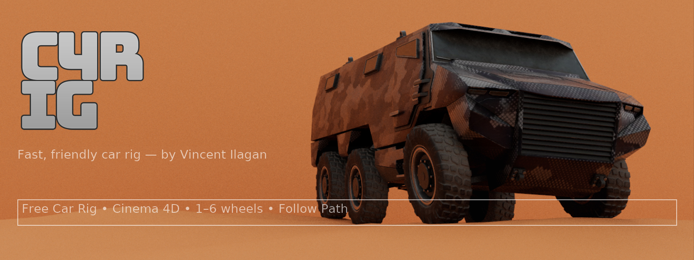
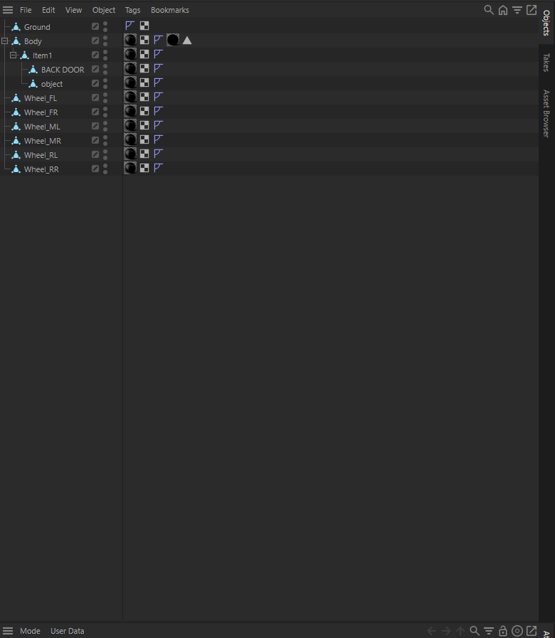
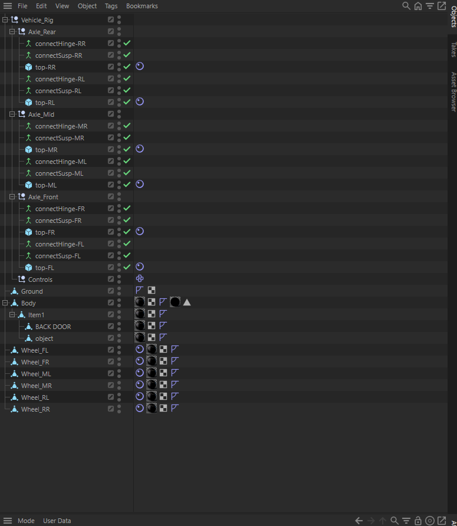
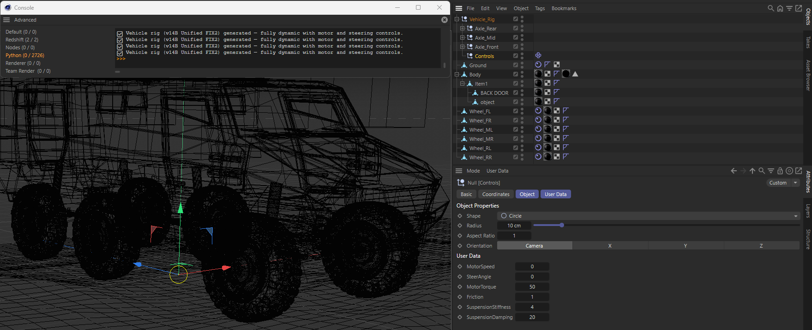

<p align="center">
  
</p>

# AutoVehicleRig v14C — Hybrid Dynamics + Motor Drive  
**Cinema 4D 2025.3.3 | TYMASTER / VFXVerse Studios**  
© 2025 Vincent Ilagan  

---

Hi! I’m **Vincent Ilagan**, creator of **TYMASTER** and **VFXVerse Studios**.  
This tool builds a full **6-wheel dynamic vehicle rig** in Cinema 4D — complete with suspension, hinge connectors, and real-time motor controllers.

Everything is physics-ready: the car reacts naturally to bumps, slopes, and friction, with realistic suspension and steering control.

---

##  What it Does
- Auto-detects and aligns all wheels  
- Creates suspension + hinge connectors  
- Adds anchor cubes (“top”) linking each wheel to the Body  
- Organizes all parts by axle (Front, Mid, Rear)  
- Adds controller sliders for speed, torque, friction, and steering  
- Fully dynamic and gravity-ready  

---

##  Key Features
✅ One-click automatic setup  
✅ Uses new Cinema 4D 2025 unified dynamics (no legacy code)  
✅ Steering + Motor + Friction controls  
✅ Optional Spline-Path driving  
✅ Adjustable stiffness and damping  
✅ Color-coded hierarchy  
✅ Works for 4- or 6-wheel vehicles  

---

##  Scene Overview

### Before Running the Script
Start with the basic setup:
```
Body
Ground
Wheel_FL, Wheel_FR, Wheel_ML, Wheel_MR, Wheel_RL, Wheel_RR
```

<p align="center">
  
</p>

---

### After Running the Script
The generator builds all connectors, suspension rigs, and controller nulls.

<p align="center">
  
</p>


##  How to Use

### Step 1 — Prepare the Scene
Rename your objects exactly like this:
```
Body
Ground
Wheel_FL, Wheel_FR, Wheel_ML, Wheel_MR, Wheel_RL, Wheel_RR
```

### Step 2 — Run the Script
1. Open **Script Manager** in Cinema 4D  
2. Load `AutoVehicleRig_v14C_HybridDynamics.py`  
3. Press **Execute**  
4. A new `Vehicle_Rig` will appear with all axles and controllers organized  

---

##  Control Overview
| Control | Description |
|:--|:--|
| **MotorSpeed** | Drives vehicle forward / backward |
| **MotorTorque** | Controls motor power |
| **SteerAngle** | Turns front wheels left / right |
| **Friction** | Adjusts tire grip and road slip |
| **SuspensionStiffness** | Sets spring resistance |
| **SuspensionDamping** | Smooths bounce and recoil |
| **SplinePath** | Drag a spline here for auto path-follow |

---

##  Connection Summary
If a connector appears unlinked, use this reference table:

| Connector | Object A | Object B |
|:--|:--|:--|
| connectSusp-FL | top-FL | Wheel_FL |
| connectHinge-FL | top-FL | Wheel_FL |
| connectSusp-FR | top-FR | Wheel_FR |
| connectHinge-FR | top-FR | Wheel_FR |
| connectSusp-ML | top-ML | Wheel_ML |
| connectHinge-ML | top-ML | Wheel_ML |
| connectSusp-MR | top-MR | Wheel_MR |
| connectHinge-MR | top-MR | Wheel_MR |
| connectSusp-RL | top-RL | Wheel_RL |
| connectHinge-RL | top-RL | Wheel_RL |
| connectSusp-RR | top-RR | Wheel_RR |
| connectHinge-RR | top-RR | Wheel_RR |

Each connector links the **top cube (anchor)** to its **wheel object**.

---

## 🧠 Technical Notes
- Optimized for **Cinema 4D 2025.3.3 Unified Dynamics**  
- Uses `Wheel Suspension` + `Hinge Motor` types  
- Auto-adds Rigid Body tags to Body and Wheels  
- All rotations zeroed for alignment  
- Axle colors:  
  🔵 Front   🟢 Mid   🔴 Rear   🟡 Controls  

---

## 🛠️ Tips
- Add a **Collider Body** tag to `Ground`  
- Set `Body` mass ≈ **1200 kg**  
- Tweak stiffness / damping for road type  
- Use the Controls null to test movement  
- Supports manual and spline drive modes  

---

## 🖼 Example Preview
<p align="center">
  
</p>

---

## 🧑‍🎨 Credits
Created by **Vincent Ilagan**  
**TYMASTER / VFXVerse Studios**  
© 2025 All Rights Reserved  

Part of the **TYMASTER AI Vehicle Dynamics Series** for filmmakers, 3D artists, and simulation developers.

---

## 🚀 Coming Soon (v15 Preview)
- Torque-balanced drive system  
- Real-time steering feedback  
- AI Spline path drive  
- Advanced off-road balancing  

---

## 🖋 Notice
Because **Cinema 4D 2025's new connector system** no longer exposes direct Object IDs,  
**Object A and Object B must be connected manually after generation.**  
Simply drag each `top-xx` object to **Object A** and its matching wheel to **Object B** in the connector's attributes.

Once linked, the rig is **fully functional** — all controllers and line-path driving work perfectly with full physics.

---

> 🚗 **“Build fast, simulate smart.”**  
> — *Vincent Ilagan, TYMASTER / VFXVerse Studios*